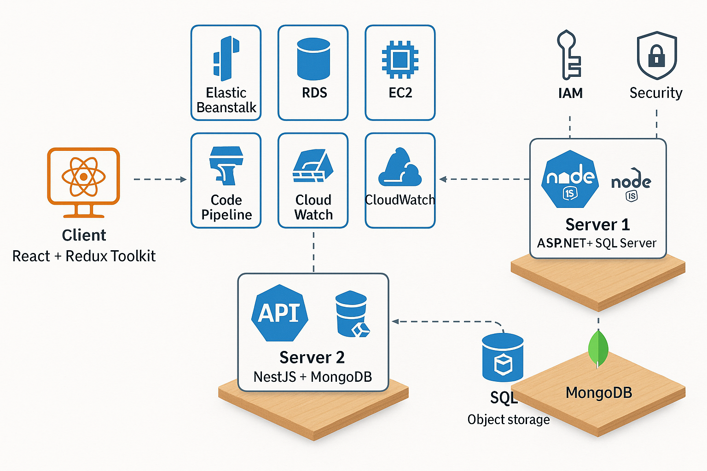

[README.md](https://github.com/user-attachments/files/21406289/README.md)

# Shopping List System - Cloud & DevOps Project

## 🔗 קישור לריפוזיטורי
[https://github.com/sara-weller/shopping-list-system](https://github.com/sara-weller/shopping-list-system)

---

## 🧩 רכיבי המערכת

1. **Client**: אפליקציית React + Redux Toolkit
2. **Server 1**: ASP.NET 8 Web API + Entity Framework עם SQL Server
3. **Server 2**: Node.js API עם חיבור ל־ Elasticsearch
---

## 🛠 הוראות התקנה והרצה

### 1. הרצת צד לקוח (React)

```bash
cd client
npm install
npm start
```

### 2. הרצת שרת ASP.NET

- פתחי את התיקייה `dotnet-server` ב־Visual Studio
- ודאי ש־SQL Server פעיל
- הריצי את הפרויקט

### 3. הרצת NestJS

```bash
cd nest-server
npm install
npm run start:dev
```

### 4. קובץ `.env` לדוגמה (לשים בכל שירות)

```env
# לדוגמה עבור Nest
MONGO_URI=mongodb://localhost:27017/orders
```

---

## ☁️ דרישות ענן ו־DevOps

### ✔️ 1. תיאור הארכיטקטורה והרכיבים

- הסביבה נבנתה על AWS:
  - **Elastic Beanstalk** לפריסת ה־API הראשי
  - **S3** לאחסון קבצים
  - **RDS (SQL Server)** לבסיס הנתונים
  - **EC2 / ECS** להרצת שירותי NestJS
  - **CloudWatch** לניטור
  - **IAM** לניהול הרשאות
  - **CodePipeline** לאוטומציית פריסה

### ✔️ 2. שרטוט ארכיטקטורה



### ✔️ 3. הסבר תפקידי רכיבים (דגש על DevOps)

| רכיב | תפקיד |
|------|-------|
| Elastic Beanstalk | ניהול סביבת הפרויקט ופריסה אוטומטית |
| S3 | אחסון קבצים והעלאות מהפרונט |
| RDS | אחסון נתונים רלציוניים עבור ASP.NET |
| EC2 / ECS | הרצת שירות NestJS |
| CloudWatch | ניטור תעבורה, לוגים והתראות |
| IAM | הרשאות למשתמשים ושירותים |
| CodePipeline | בנייה ופריסה אוטומטית לאחר push ל־Git |

---
